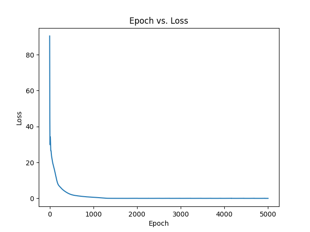

# Physics-Informed Neural Network

This project is a test project to learn the working of a Physics-Informed Neural Network (PINN) and compare its performance to traditional computation using mathematical functions.

## Training Loop

Below is the training epoch vs loss graph:

## Performance Comparison

The output statistics are detailed in [output.txt](output.txt). At its best, the PINN outperforms the CPU by a factor of 174.0283.

Imagine you are running a Digital Twin or a real-time simulation that needs to calculate the physics state 30 times per second (30 FPS) to look smooth to a human eye.

| Feature | Mathematical Solver (CPU) | PINN Inference (GPU) |
|---|---|---|
| Time per Frame | 34.33 ms | 0.19 ms |
| Max Frames Per Second | ~29.13 FPS | ~5,263 FPS |
| System Load | 100% CPU (Maxed out just to keep up) | <1% GPU |